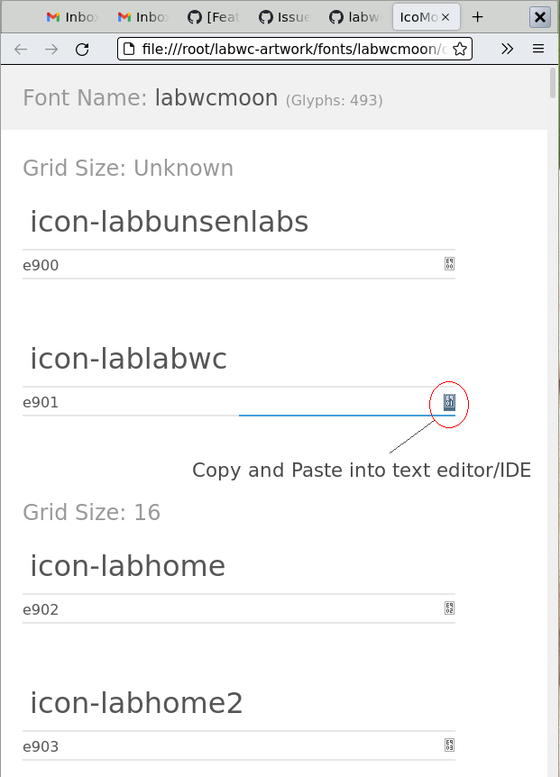

# USAGE

- install the `labwcmoon.ttf` font in your font directory and run the appropriate tools (consult your distro docs for that)
- open up `doc/demo.html` in your web browser
- simply copy and paste the character to your text editor or even your word processor, as long as `labwcmoon` is the selected font. See screenshot.
- use it in bars such as [Waybar](https://github.com/Alexays/Waybar), [yambar](https://codeberg.org/dnkl/yambar) or in your menu.

For further docs se the [IcoMoon Docs](https://icomoon.io/#docs)
